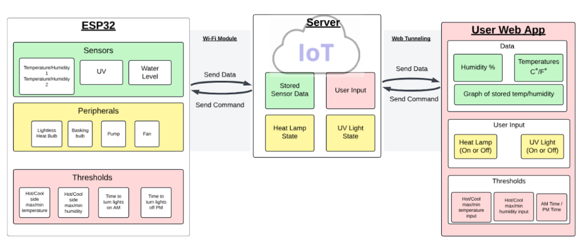
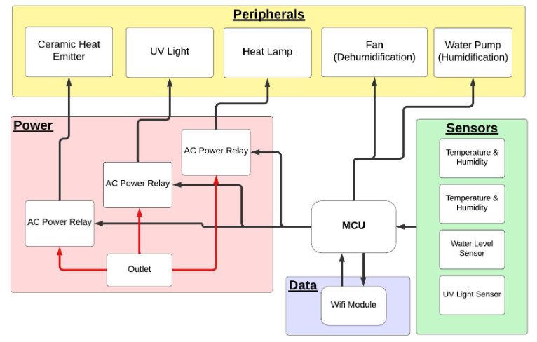
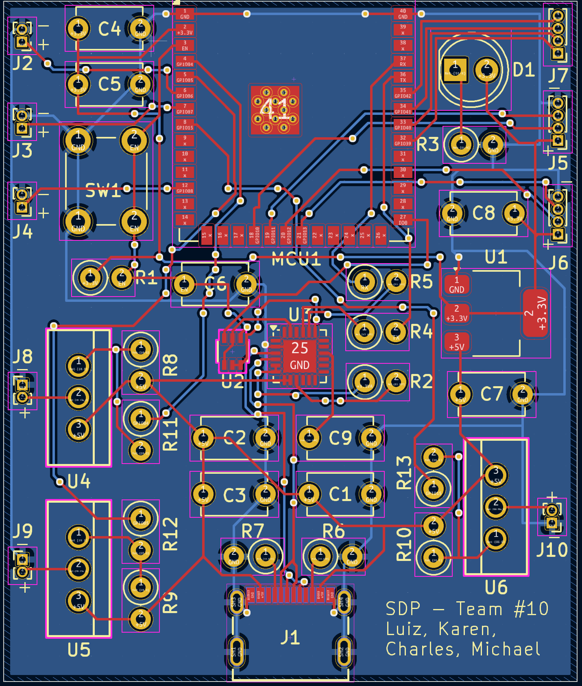
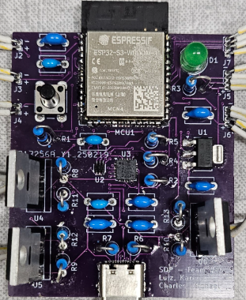

<!-- PROJECT TITLE -->
# Lizard-Lounge
Lizard Lounge is a project manufactured by a team of four as part of our senior design project at UMass Amherst. 

The goal is to create a __consistently maintained environment aimed for basking reptiles such as bearded dragons.__ 

The project consists of the vivarium itself, a custom PCB and built-in peripherals, and a user web application.

<!-- PROJECT LOGO -->
 

<pre><code>
.__  .__                         .___ .__                                      
|  | |__|____________ _______  __| _/ |  |   ____  __ __  ____    ____   ____  
|  | |  \___   /\__  \\_  __ \/ __ |  |  |  /  _ \|  |  \/    \  / ___\_/ __ \ 
|  |_|  |/    /  / __ \|  | \/ /_/ |  |  |_(  <_> )  |  /   |  \/ /_/  >  ___/ 
|____/__/_____ \(____  /__|  \____ |  |____/\____/|____/|___|  /\___  / \___  >
⠀⠀⠀⠀⠀⠀⠀⠀⠀⠀⠀ \/     \/           \/                         \//_____/      \/ 
⠀⠀⠀⠀⠀⠀⠀⠀⠀⠀⠀⠀⠀⠀⠀⠀⠀⠀⠀⠀⠀⠀⠀⠀⠀⠀⠀⠀⠀⠀⠀⠀⢠⣢⣭⠓⣶⣶⣯⣽⣦⠀⠀⠀⠀⠀⠀⠀⠀⠀
⠀⠀⠀⠀⠀⠀⠀⠀⠀⠀⠀⠀⠀⠀⠀⠀⠀⠀⠀⠀⠀⠀⠀⠀⠀⠀⠀⠀⠀⠀⣀⣴⠿⠤⢯⣾⡿⢞⣫⣭⣍⢦⠀⠀⠀⠀⠀⠀⠀⠀
⠀⠀⠀⠀⠀⠀⠀⠀⠀⠀⠀⠀⠀⠀⠀⠀⠀⠀⠀⠀⠀⠀⠀⠀⠀⠀⠀⢤⣦⣾⣯⣵⡾⢟⣫⣵⠾⠛⣉⣤⡌⣿⠀⠀⠀⠀⠀⠀⠀⠀
⠀⠀⠀⠀⠀⠀⠀⠀⠀⠀⠀⠀⠀⠀⠀⠀⠀⠀⠀⠀⠀⠀⠀⠀⠀⠠⣀⣤⣽⢰⣟⣵⠿⢛⣩⣤⣶⣿⣿⣿⡇⣿⠀⠀⠀⠀⠀⠀⠀⠀
⠀⠀⠀⠀⠀⠀⠀⠀⠀⠀⠀⠀⠀⠀⠀⠀⠀⠀⠀⠀⠀⠀⠀⠀⠀⠼⢿⣿⣿⣾⣭⣶⣾⣿⣿⣿⣿⣿⣿⣿⣿⣿⡆⠀⠀⠀⠀⠀⠀⠀
⠀⠀⠀⠀⠀⠀⠀⠀⠀⠀⠀⠀⠀⠀⠀⠀⠀⠀⠀⠀⠀⠀⠀⠀⠀⠀⠀⣤⣝⣛⡙⠛⠿⠻⣿⣿⣿⡿⣿⣿⡿⠛⠇⠀⠀⠀⠀⠀⠀⠀
⠀⠀⠀⠀⠀⠀⠀⠀⠀⠀⠀⠀⠀⠀⠀⠀⠀⠀⠀⠀⠀⠀⠀⠀⠀⠀⠀⠻⣿⣿⣿⣿⢟⣠⣅⣀⣠⣴⣿⡟⠁⠀⠀⠀⠀⠀⠀⠀⠀⠀
⠀⠀⠀⠀⠀⠀⠀⠀⠀⠀⠀⠀⠀⠀⠀⠀⠀⠀⠀⠀⠀⠀⠀⠀⠀⣠⣶⣦⡈⠫⢍⣛⣿⣿⠿⠿⠿⠟⠋⠀⢀⣾⣿⣆⠀⠀⠀⠀⠀⠀
⠀⠀⠀⠀⠀⠀⠀⠀⠀⠀⠀⠀⠀⠀⠀⠀⠀⠀⠀⠀⠀⠀⢀⣠⣴⣿⣿⣿⣿⣶⣄⡈⠉⠉⠁⢀⣀⣀⣀⣴⣿⣿⣿⣿⣧⠀⠀⠀⠀⠀
⠀⠀⠀⠀⠀⠀⠀⠀⠀⠀⠀⠀⠀⠀⠀⠀⠀⠀⠀⠀⢠⣾⣿⣿⣿⣿⣿⣿⣿⣿⣿⣿⣦⣴⣾⣿⣿⣿⣿⣿⣿⢻⣿⣿⣿⣆⠀⠀⠀⠀
⠀⠀⠀⠀⠀⠀⠀⠀⠀⠀⠀⠀⠀⠀⠀⠀⠀⠀⠀⠀⣾⣿⣿⣿⣟⠉⢿⣿⣿⣿⣿⣿⣿⣿⣿⣿⣿⣿⣿⣿⣿⢈⣿⣿⣿⣿⡳⠦⢤⡀
⠀⠀⠀⠀⠀⠀⠀⠀⠀⠀⠀⠀⠀⠀⠀⠀⠀⠀⠀⠀⢻⣿⣿⣿⣿⣷⣦⣙⡻⢿⣿⣿⣿⣿⣿⣿⣿⣿⠿⠛⠁⣸⢯⡿⠿⣮⡻⣄⠀⠈
⠀⠀⠀⠀⠀⠀⠀⠀⠀⠀⠀⠀⠀⠀⠀⠀⠀⠀⠀⠀⠀⠉⠙⠻⣿⠹⣿⢿⠙⣆⠙⠻⠿⠿⠛⠋⠉⠀⠀⠀⠀⣿⠘⡇⠀⠈⠳⡌⢣⠀
⠀⠀⠀⠀⠀⠀⠀⠀⠀⠀⠀⠀⠀⠀⠀⠀⠀⠀⠀⠀⠀⠀⠀⢀⠏⠀⢹⡎⡇⢸⠀⠀⠀⠀⠀⠀⠀⠀⠀⠀⠀⠘⠀⠐⠀⠀⠀⠰⠀⠁
⠀⠀⠀⠀⠀⠀⠀⠀⠀⠀⠀⠀⠀⠀⠀⠀⠀⠀⠀⠀⠀⠀⠀⠁⠀⠀⠀⠇⠁⠀⠀⠀⠀⠀⠀⠀⠀⠀⠀⠀⠀⠀⠀⠀⠀⠀⠀⠀⠀⠀

</code></pre>

ASCII Art from [asciiart.eu](https://www.asciiart.eu)

<!-- PROBLEM STATEMENT -->
## Problem Statement
Maintenance of a vivarium is tedious and difficult.

One has to regulate temperature, humidity, and UV. This requires constant attention and has a steep learning curve, as it can very hard to adjust those variables properly. Either by lack of care due to time or lack of experience, a non-ideal environment can be fatal for a pet. 

This issue is what our assisted automated vivarium helps alleviate.

<!-- FILE STRUCTURE -->
## Project Repository Layout

<pre><code>
  Lizard-Lounge/
  ├── images/ 
  ├── README.md 
  ├── Lizard_Lounge_Server.zip // All server files zipped with virtual environment      
  └── Lizard_Lounge      // Main Arduino folder
</code></pre>
      
<!-- PROJECT TECHNOLOGIES -->
## Software Technologies

Built with:

*   
*   
*   
*   
*   
*   

The web application folder can be found under 'Lizard Lounge Web Server'. The main web app structure is held in the *app.py* file. The HTML/CSS (Work in Progress) is held in *templates/index.html*. 

The Arduino code for the ESP32 PCB can be found in the 'Lizard Lounge' folder as *Lizard_Lounge.ino* (Work in Progress).

## Hardware Technologies

### PCB Design

Built with:
* 
* ESP32-S3 WROOM-1 Microprocessor
  

#### Sensors
* 2 Temperature/humidity sensors
* UV Sensor
* Water Level Sensor

#### Peripherals
* Basking Bulb & Ceramic Heat Emitter
* UV Light Bar
* 5V Fan
* 5V Pump
* 3 IOT Relays
    
_The IOT Relays are part of a project restriction that does not allow students to open devices interacting with outlet power. To allow our ESP32 to turn on and off relays connected to our lights and heat emitters, we had to circumnavigate this restriction by utilizing three IOT Relays, one per UV light, basking bulb, and ceramic heat emitter. A more cost effective and efficient solution would be to use relay channels, however they were restricted by our college guidelines for this project._

## Project Goals

#### Feedback Control
- [x] Peripherals react to current environment
  - i.e. When humidity too low, turn on pump. When humitiy too high, turn on fan.
- [x] Add feedback model to stabilize environment efficiently

#### Main Cage Setup
- [x] Improve stability of vivarium
- [x] Clean up wiring
- [x] Ease of water replacement for water pump

#### Web Application
- [x] Working server
- [x] Changeable user thresholds for temperature and humidity
- [x] Collect & Store data over time
- [x] User alerts for when water level low, UV light low
- [x] Refined website & server

FINALIZED PROJECT DUE MAY 15th

⠀
